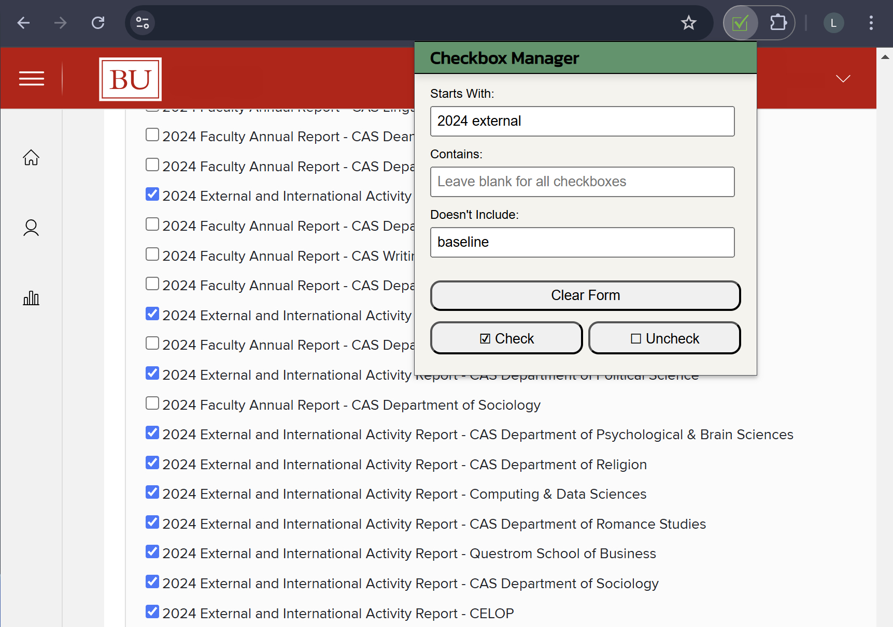

# Checkbox Manager

A Google Chrome extension for checking or unchecking a large amount of checkboxes. It also allows you to filter or remove criteria when selecting which checkboxes to use.

This extension can be installed directly from the [Chrome Web Store](https://chromewebstore.google.com/detail/checkbox-manager/oaobkimgccbhhahoaabdoahpedlaknfc?authuser=0&hl=en-GB).

